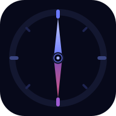

<p align="center">
  
</p>

<h1 align="center">Kompass</h1>

<p align="center">
  A personal <strong>Professional Learning Network</strong> dashboard.<br/>
  Set goals, take notes, reflect, and track your learning — all in one place.
</p>

<p align="center">
  <a href="https://github.com/Imagine-The-World-people/my-pln-dashboard/actions/workflows/deploy.yml">
    
  </a>
  
  
  
  
</p>

---

## What is Kompass?

Kompass is a Norwegian word for **compass** — it helps you find your direction in learning.

It is a fully offline-capable web app (PWA) that a learner installs on their phone or opens in a browser. No app store required. Data is stored locally and can be synced across devices via Supabase when the user signs in.

> Built as part of a professional learning project, with transparent use of AI tools throughout development.

---

## Features

| Section | What you can do |
|---------|----------------|
| **Dashboard** | See all your stats at a glance — goals, notes, streak, activity chart |
| **Goals** | Add, complete, reorder (drag & drop), set deadlines, track milestones |
| **Resources** | Collect links and books, rate them, organize into colour-coded collections. Detail modal is fully responsive (mobile bottom-sheet). Add panel scrolls internally. Cards clamp descriptions to 3 lines for a uniform grid. |
| **Notes** | OneNote-like full-page editor — ribbon toolbar (bold, italic, underline, strikethrough, font size, text colour, highlight, H1/H2/H3, alignment, indent/outdent, bullet/numbered/checklist, links, HR, code block), pin notes, search, draw with a stylus or finger. Resizable left/right sidebars (drag handle or double-click to collapse). Right sidebar shows live Outline (click heading to scroll) and Page Info (words, characters, reading time). Fully themed in the ocean blue design system. |
| **Reflections** | Log reflections in a timeline, get weekly writing prompts |
| **Insights** | Analytics — streak calendar, category breakdown, activity chart |

### Everything else
- 🌗 **Dark / light theme** with persistence
- 🌐 **Norwegian and English** — full app translation including login
- ☁️ **Cloud sync** via Supabase — real-time updates across devices
- 💾 **Offline-first** — works without internet, syncs when back online
- 📱 **Installable PWA** — add to home screen on Android and iOS
- ⌨️ **Keyboard shortcuts** — `Ctrl+K` command palette, `Alt+1–6` sections, `?` for help
- ⏱️ **Focus timer** — 25-minute Pomodoro with live ring in the header
- 🔔 **Deadline notifications** — browser alerts for overdue goals
- 🗑️ **Undo delete** — 5-second undo toast on every delete

---

## Tech Stack

| Layer | Choice | Why |
|-------|--------|-----|
| Markup | HTML5 | Semantic, accessible structure |
| Styling | CSS3 — custom properties, Grid, `clamp()`, `backdrop-filter` | No framework needed for this scale |
| Logic | Vanilla JavaScript ES2020 | Fast, zero dependencies at runtime |
| Build | [Vite 8](https://vitejs.dev) | Instant dev server, optimised production build |
| Backend | [Supabase](https://supabase.com) v2 | Auth, Postgres, Realtime, Storage — free tier |
| Font | [Plus Jakarta Sans](https://fonts.google.com/specimen/Plus+Jakarta+Sans) | Modern, readable, professional |
| Testing | [Playwright](https://playwright.dev) | E2E tests across real browsers |
| CI/CD | GitHub Actions → GitHub Pages | Every push to `main` auto-deploys |

---

## Project Structure

```
kompass-pln/
├── .github/
│   └── workflows/
│       └── deploy.yml        # CI — build + deploy to GitHub Pages on push
├── public/
│   ├── icon.svg              # Source icon (vector)
│   ├── icon-192.png          # PWA icon — Android home screen
│   ├── icon-512.png          # PWA icon — splash screen / install
│   ├── manifest.json         # Web App Manifest
│   └── sw.js                 # Service Worker — offline caching
├── tests/
│   └── app.spec.js           # Playwright E2E tests
├── .editorconfig             # Consistent code formatting across editors
├── .env.example              # Required environment variables template
├── .gitignore
├── index.html                # App entry point (single page)
├── LICENSE
├── package.json
├── playwright.config.js
├── README.md
├── responsive.css            # All media query overrides
├── script.js                 # Application logic (ES module, ~5 300 lines)
├── style.css                 # Design system — tokens, components, animations
├── supabase-config.js        # Supabase client initialisation
└── vite.config.js            # Build configuration
```

---

## Getting Started

### 1. Run locally

```bash
git clone https://github.com/Imagine-The-World-people/my-pln-dashboard.git
cd my-pln-dashboard
npm install
npm run dev
```

Open [http://localhost:5173](http://localhost:5173). The app works immediately with `localStorage` — no backend needed.

### 2. Enable cloud sync (optional)

1. Create a free project at [supabase.com](https://supabase.com)
2. Copy `.env.example` → `.env.local` and fill in your project URL and anon key
3. Create a `user_data` table in Supabase:

```sql
create table user_data (
  user_id  uuid primary key references auth.users(id) on delete cascade,
  goals       jsonb default '[]',
  notes       jsonb default '[]',
  reflections jsonb default '[]',
  updated_at  timestamptz default now()
);
alter table user_data enable row level security;
create policy "Users access own data"
  on user_data for all
  using  (auth.uid() = user_id)
  with check (auth.uid() = user_id);
```

4. Sign in via the login screen — data syncs automatically

### 3. Deploy to GitHub Pages

1. Go to **Settings → Pages → Source → GitHub Actions**
2. Push any change to `main`
3. The workflow in `.github/workflows/deploy.yml` builds and deploys automatically

---

## Architecture

All JavaScript lives in `script.js` as a single ES module. Functionality is split into self-contained object modules:

| Module | Responsibility |
|--------|---------------|
| `Navigation` | Section switching with directional slide animation |
| `I18n` | Norwegian ↔ English with `data-i18n` binding |
| `Theme` | Dark / light mode persistence |
| `Auth` | Supabase email/password auth + cloud sync trigger |
| `CloudSync` | Save / load user data to Supabase `user_data` table |
| `RealtimeSync` | Postgres CDC subscription — live updates across devices |
| `Dashboard` | Stat cards, countUp animation, streak, suggestions |
| `Goals` | CRUD, drag-and-drop sort, deadline badges, milestones |
| `GoalDetailDrawer` | Side-panel detail view for a single goal |
| `Resources` | CRUD, search, type/category/tag filtering |
| `ResourceGroups` | Colour-coded collections with create/edit/delete |
| `Notes` | CRUD, drawing canvas, file attachments, pin |
| `Reflections` | Timeline CRUD, weekly prompt banner |
| `Insights` | Analytics — KPI cards, streak calendar, bar chart |
| `Focus` | 25-minute Pomodoro timer with header mini-ring |
| `AutoLogout` | Idle-timeout session expiry |
| `DeadlineNotifier` | Browser Notification API for overdue goals |
| `ProfileModal` | Avatar, display name, password change |

---

## AI Usage

This project was built with the assistance of **GitHub Copilot** (Claude Sonnet 4.6) throughout development.

AI was used for:
- Generating boilerplate (modal HTML, CSS component scaffolding)
- Debugging logic errors (canvas sizing, cloud sync race conditions)
- Code review (identifying 11 bugs across the codebase)
- Writing this README

All AI-generated code was reviewed, tested, and adapted before committing. Architecture decisions, feature design, and UX choices are the developer's own.

> Using AI as a tool — not as a replacement for understanding — is a core part of the learning this app is designed to support.

---

## Responsive Breakpoints

| Breakpoint | Layout |
|-----------|--------|
| `> 1200px` | Full desktop — sidebar + content |
| `≤ 1200px` | Compact grids, reduced padding |
| `≤ 900px` | Sidebar collapses to icon rail |
| `≤ 768px` | Mobile — bottom tab bar, full-width cards |
| `≤ 480px` | Narrow — single column, large tap targets |
| `≤ 360px` | Very small — micro layout adjustments |

---

## License

[MIT](LICENSE) — free to use, modify, and share.
